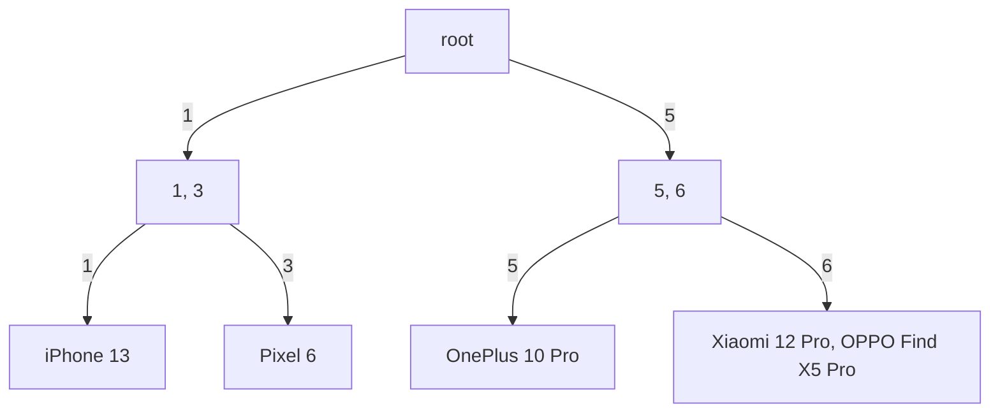

# Inner Architecture of PostgreSQL

PostgreSQL is a relational database management system (RDBMS) that uses a client-server architecture.

The inner architecture of PostgreSQL is divided into several layers:

* **Postmaster** process: The main process that controls the server. It starts up the other processes, manages the database files, and handles incoming connections from clients.
* **Backend** processes: Responsible for processing queries from clients. Each backend process is dedicated to a single client connection.
* **Background** processes: Perform tasks that are not directly related to processing queries, such as vacuuming the database, checkpointing the database, and archiving the WAL files.
* **Shared Memory** area: A region of memory that is shared by all of the processes in the PostgreSQL server. This area contains data that is used by all of the processes, such as the system catalog and the transaction log.

The inner architecture of PostgreSQL is designed to be scalable and efficient. The use of separate processes for each client connection allows the server to handle a large number of concurrent connections. The use of shared memory allows the processes to communicate with each other quickly and efficiently.

Here are some additional details about how PostgreSQL stores data:

1. PostgreSQL stores data in a variety of data structures, including tables, indexes, and sequences.
2. Tables are the main data structure in PostgreSQL. They are used to store related data in rows and columns.
3. Indexes are used to speed up queries by providing a way to quickly locate specific rows in a table.
4. Sequences are used to generate unique values.

The creation, update, retrieval, and deletion time complexity of data in PostgreSQL depends on the data structure that is used. For example, the creation of a table is a O(1) operation, while the retrieval of a row from a table is a O(log n) operation.

## Data Structures Used in PostgreSQL

PostgreSQL uses a variety of data structures to store data, including:

* **B-trees** are used to store indexes. B-trees are a type of balanced tree, which means that the height of the tree is logarithmic in the number of nodes. This makes B-trees very efficient for searching and traversing.
* **Hash tables** are used to store data that is frequently accessed. Hash tables are a very fast data structure for lookups, but they are not as efficient for insertion and deletion.
* **Linked lists** are used to store data that is frequently updated. Linked lists are a very efficient data structure for insertion and deletion, but they are not as efficient for lookups.
* **Sequences** are used to generate unique values. Sequences are implemented using a counter, which is incremented each time a new value is generated.


The specific data structure that is used for a particular operation depends on the nature of the operation and the requirements of the application. For example, a B-tree would be used for a query that requires a range of values, while a hash table would be used for a query that requires a single value.


Here is a table that summarizes the time complexity of some common operations in PostgreSQL:

Operation | Data Structure | Time Complexity
---|---|---|
Create table | O(1) |
Insert row | O(log n) |
Update row | O(log n) |
Retrieve row | O(log n) |
Delete row | O(log n) |

PostgreSQL uses a **B+ tree** to store indexes. B+ trees are a variation of B-trees that are optimized for sequential access. B+ trees are more efficient than B-trees for retrieving rows in sorted order, but they are not as efficient for searching for specific rows.

Here are some of the key features of B+ trees:

* Each node in a B+ tree contains a pointer to the next node in the tree.
* The leaves of a B+ tree store the actual data.
* The internal nodes of a B+ tree store the keys and pointers to the next nodes.
* The number of keys in each node is always between a minimum and maximum value.
* The minimum and maximum number of ke  ys in a node are usually chosen so that the height of the tree is logarithmic in the number of nodes.

B+ trees are a very efficient data structure for storing and retrieving large amounts of data. They are used by many different database systems, including PostgreSQL, MySQL, and Oracle.

                           root
                        /          \
                     10          15
                    /   \        /  \
                   5    12    17    20
                  / \   / \   / \   / \
                  2   7  11  18  21  25
                / \  / \  / \  / \  / \
               1   3  6   9  14  19  22

A visualization for a B+ tree for the following table:

Sure, here is a better visualization for a B+ tree for the following table:

```
id | name | price
---|---|---|
1 | iPhone 13 | 999
2 | Galaxy S22 | 899
3 | Pixel 6 | 599
4 | OnePlus 10 Pro | 899
5 | Xiaomi 12 Pro | 799
6 | OPPO Find X5 Pro | 899
```

The minimum and maximum number of keys in each node of the B+ tree is 3 and 5, respectively. The root node contains the keys 1, 3, and 5. The left child of the root node contains the keys 1 and 3, and the right child of the root node contains the keys 5 and 6. The leaves of the tree contain the actual data. In this example, the leaves contain the values iPhone 13, Pixel 6, and OnePlus 10 Pro.



The visualization shows that the B+ tree is a balanced tree. This means that the height of the tree is logarithmic in the number of nodes. This makes the B+ tree very efficient for searching and traversing.
